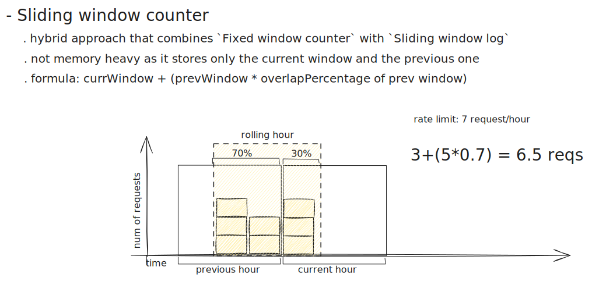

# pylimiter 
popular rate limiter algorithms wrote in python

## token bucket

```python
SOME_IP = "111.222.1.1"

"""
:param int bucket_size: maximum number of tokens in the bucket
:param float refill_rate: token refill rate in seconds
:param Callable[[], float] time_func: function that returns the current time in seconds. Default: monotonic
"""
limiter = TokenBucketLimiter(bucket_size=3, refill_rate=1)

for _ in range(3):
    assert limiter.allow(SOME_IP) == True
    
assert limiter.allow(SOME_IP) == False
```


## sliding window counter 


```python
SOME_IP = "111.222.1.1"

"""
:param int max_requests: maximum number of requests in a window
:param str window_unit: "second" | "minute" | "hour". Default: "minute"
:param Callable[[], float] time_func: function that returns the current time in seconds. Default: monotonic
"""
limiter = SlidingWindowCounterLimiter(max_requests=3, window_unit="second")

for _ in range(3):
    assert limiter.allow(SOME_IP) == True
    
assert limiter.allow(SOME_IP) == False

```